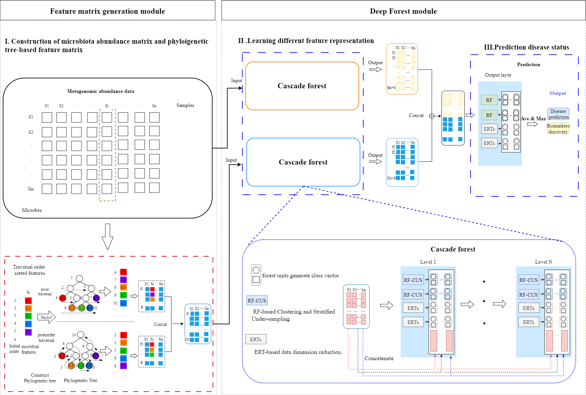

# MicroHDF : predicting host phenotypes with metagenomic data using a deep forest-based framework

The accurate classification of host phenotypes based on microbiome data with machine learning (ML) methods has attracted a lot of attention recently. However, decreased accuracy and poor generalisation are widespread in the host phenotype prediction task owing to metagenomic data with a low sample size, class imbalance, and high-dimensional features, etc. To address these factors of impacted model prediction, we propose MicroHDF, a novel interpretable deep learning framework utilizing ensemble cascade layers composed of various deep forest units to tackle these challenges. 


## Framework of MicroHDF

Our framework follows a three-step procedure: 
- (i) construction of the microbial abundance matrix and phylogenetic tree-based feature matrix to facilitate proper learning; 
- (ii) utilisation of deep forest units to learn different feature representations; 
- (iii) utilisation of class distributions to make predictions.

 

-------------------------------------

## Installation

#### Dependencies:</BR>

* threadpoolctl = 3.1.0
>
* python = 3.7.0
>
* scikit-learn = 1.0.2
>
* pandas = 1.1.5
>
* joblib = 1.3.2
>
* imbalanced-learn = 0.12.3

yon can install the  version of  MicroHDF via [Anaconda](https://anaconda.org/) with:<BR/>

``` python
 git clone https://github.com/liaoherui/MicroHDF.git

 cd MicroHDF

 conda env create -f environment.yaml
 
 conda activate MicroHDF

 python multi_channel_MicroHDF.py

``` 
-------------------------


## Usage


### 1. Input data (Feature abundance table and metadata)

To use MicroHDF, you need to provide microbial abundance profile (csv format), metadata.

#### Format of abundance table:

⚠️**Importantly, the input abundance table should include hierarchical level information.**

- The rownames are samples.
- <div class="long-text">The colnames are feature (e.g.k__Archaea|p__Euryarchaeota|c__Methanobacteria|o__Methanobacteriales|f__Methanobacteriaceae|g__Methanobrevibacter s__Methanobrevibacter_smithii).</div>
- The abundance value can be read counts or normalized values .

An example code tailored for a microbial abundance table is as follows:

| sampleID          |s__Methanobrevibacter_smithii | ...     |
|--------------|------------|------------|
| HD-10 |0.0654  |...   |
| HD-11|0.0   |...   |
| HD-12  |0.06806  |...   |

#### Format of metadata table:

- The rownames are samples, columns are groups.
- The grouping variable can be categories (normal or disease ).

| sampleID     |disease  | ...     |
|--------------|------------|------------|
| HD-10 |0 |...   |
| HD-11|1  |...   |
| HD-12  |1   |...   |

### 2. Build phylogenetic tree information

- We obtained a phylogenetic tree using Newick and generated PhyIoT using the method provided in ETE3. The phylo_feature.py provides a set of processes for running code. It extracts the phylogenetic relationship information of taxa by performing level-order traversal and post-order traversal on the nodes of the tree.

 ``` python
python phylo_feature.py
```

The result is a phylogenetic tree matrix.<br/>

|      |239935  | ...     |
|--------------|------------|------------|
|1|0.0034 |...   |
| 2|8.52552 |...   |
| 3  |0.00481   |...   |


### 3. Run MicroDF


#### Runing our model

```python
python multi_channel_MicroHDF.py
```


#### Batch effect removeing
- We used the MMUPHin package for batch effect processing. MMUPHin is an R package for meta-analysis tasks of microbiome cohorts. 

 ```R
Rscript Batcheffect_removed.R
 ```


#### 

## Contact

If you have any questions, please directed to the corresponding authors : 975884322@qq.com 

